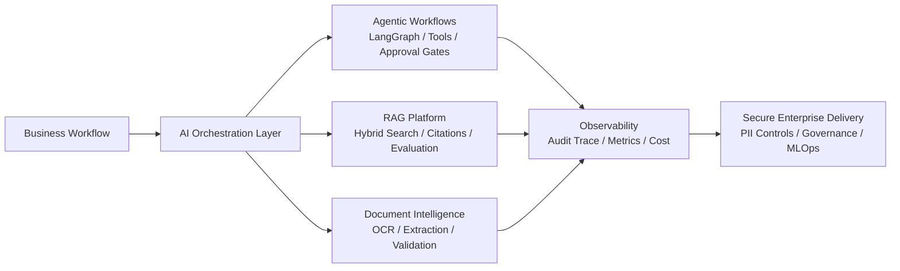

# Prasun Kumar

**AI/ML Technical Lead | GenAI & Agentic AI Solution Architect | LangGraph | RAG | Azure AI | LLMOps | Enterprise AI Platforms**

I design and deliver production-minded AI systems across Agentic AI, LLM
applications, Retrieval-Augmented Generation, document intelligence, automation,
and MLOps. My focus is building enterprise AI platforms that are observable,
governed, secure, cost-aware, and practical enough to run inside real business
workflows.

I bring **8.5+ years of software engineering experience** with hands-on AI/ML
delivery, technical leadership, system design, cloud-native architecture, and
cross-functional execution.

## Architecture Focus

## Technical Expertise Matrix

| Area | Hands-on Focus |
| --- | --- |
| Agentic AI | LangGraph-style orchestration, planner/retriever/validator/executor patterns, tool routing, approval gates |
| LLM Applications | Azure OpenAI, open-source LLM patterns, prompt governance, structured extraction, hallucination reduction |
| RAG Systems | Chunking, embeddings, hybrid retrieval, reranking, citations, recall/precision evaluation, feedback loops |
| LLMOps / MLOps | Evaluation harnesses, quality gates, model lifecycle cleanup, monitoring, reproducibility |
| Document AI | OCR pipelines, PII/PHI masking, schema validation, confidence scoring, human review |
| Cloud Architecture | Azure Functions, Service Bus, Blob Storage, Graph API, event-driven workflows, AWS exposure |
| Enterprise Governance | Audit trails, role-aware access, review queues, data minimization, AI security controls |
| Engineering Leadership | Technical design, delivery planning, code review, stakeholder alignment, production readiness |

## What I Build

- Agentic AI systems with planner, retriever, validator, executor, memory, and approval workflows.
- Enterprise RAG platforms with ingestion, chunking, hybrid search, citations, feedback loops, and quality evaluation.
- OCR + LLM document intelligence pipelines for extraction, redaction, validation, and human review.
- Event-driven AI automation using queues, retries, idempotency, dead-letter handling, and audit trails.
- LLMOps and AI governance patterns covering prompt/version control, evaluation gates, cost controls, and observability.

## Featured Repositories

| Repository | Architecture Signal |
| --- | --- |
| [enterprise-ai-ml-case-studies](https://github.com/Prasun0512/enterprise-ai-ml-case-studies) | Sanitized case studies with runnable POCs across GenAI, RAG, CV, and automation |
| [agentic-ai-langgraph-workflows](https://github.com/Prasun0512/agentic-ai-langgraph-workflows) | Multi-step agent workflow with state, tools, risk gates, and audit traces |
| [enterprise-rag-quality-lab](https://github.com/Prasun0512/enterprise-rag-quality-lab) | RAG evaluation, retrieval metrics, PII masking, and grounded answer quality |
| [document-intelligence-llm-pipeline](https://github.com/Prasun0512/document-intelligence-llm-pipeline) | OCR + LLM extraction pipeline with validation and review routing |
| [email-to-case-genai-automation](https://github.com/Prasun0512/email-to-case-genai-automation) | Event-driven GenAI automation for email, attachment, extraction, and case creation |
| [ai-resume-job-matcher](https://github.com/Prasun0512/ai-resume-job-matcher) | Explainable resume/JD matching assistant with skill gap analysis and suitability scoring |
| [enterprise-ai-architecture-showcase](https://github.com/Prasun0512/enterprise-ai-architecture-showcase) | Architecture decision records, HLD/LLD diagrams, AI security, and platform patterns |
| [enterprise-llm-evaluation-framework](https://github.com/Prasun0512/enterprise-llm-evaluation-framework) | LLM/RAG evaluation framework for faithfulness, groundedness, recall, relevance, and regression gates |
| [ai-technical-lead-playbook](https://github.com/Prasun0512/ai-technical-lead-playbook) | AI delivery lifecycle, review standards, risk management, and architecture review process |
| [enterprise-ai-case-studies](https://github.com/Prasun0512/enterprise-ai-case-studies) | Executive-style AI case studies covering problem, constraints, architecture, results, and lessons learned |
| [enterprise-integration-patterns](https://github.com/Prasun0512/enterprise-integration-patterns) | Webhooks, REST integrations, async messaging, retries, DLQs, idempotency, and audit logging |
| [multi-tenant-ai-platform](https://github.com/Prasun0512/multi-tenant-ai-platform) | Tenant isolation, RBAC, feature flags, model/vector routing, usage metering, and cost tracking |
| [enterprise-ai-platform-engineering](https://github.com/Prasun0512/enterprise-ai-platform-engineering) | Model gateway, prompt registry, guardrails, caching, routing, evaluation hooks, and cost controls |
| [ai-reliability-engineering](https://github.com/Prasun0512/ai-reliability-engineering) | Retry, circuit breaker, fallback, poison queue, runbook, and postmortem patterns for AI systems |
| [production-ai-operations](https://github.com/Prasun0512/production-ai-operations) | Deployment, rollback, canary, embedding refresh, index rebuild, monitoring, alerting, and cost playbooks |
| [engineering-leadership](https://github.com/Prasun0512/engineering-leadership) | Architecture reviews, technical decisions, mentorship, roadmaps, stakeholder communication, and team scaling |

## Enterprise AI Capabilities

- **Agentic systems:** planner/research/retrieval/validator/executor workflows, human approval, retry policies, stateful routing
- **RAG platforms:** document ingestion, OCR, metadata-aware chunking, vector search abstraction, evaluation metrics, citation generation
- **Automation platforms:** email-to-case, document-to-case, queue-based orchestration, idempotent processing, dead-letter handling
- **Governed AI:** PII/PHI redaction, auditability, prompt/version control, confidence thresholds, review queues
- **Production engineering:** Docker, CI/CD, tests, typed Python, config hygiene, observability hooks, cost controls

## Current Portfolio Direction

I am actively maintaining this profile around practical enterprise AI patterns:

- Agentic AI with LangGraph and tool-aware orchestration
- LLM evaluation and RAG quality measurement
- Azure AI platform integration patterns
- Document intelligence and workflow automation
- AI governance, security, and production readiness
- Technical leadership practices for AI delivery teams
- LLM evaluation and release-gate standards
- Enterprise integration, SaaS tenancy, platform engineering, reliability, and production AI operations

## Connect

- Portfolio: <https://prasun0512.github.io/Resume/>
- LinkedIn: <https://www.linkedin.com/in/prasun-kumar-1708/>
- YouTube: <https://www.youtube.com/@AIWizardry277>
