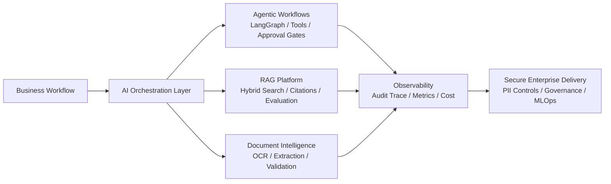

# Prasun Kumar

**AI/ML Engineer | Technical Lead | GenAI & Agentic AI Solution Architect | LangGraph | RAG | Azure OpenAI | Python**

I design and deliver production-minded AI systems across Agentic AI, LLM
applications, Retrieval-Augmented Generation, document intelligence, automation,
and MLOps. My focus is building enterprise AI platforms that are observable,
governed, secure, cost-aware, and practical enough to run inside real business
workflows.

I bring **8.5+ years of software engineering experience** with hands-on AI/ML
delivery, technical leadership, system design, cloud-native architecture, and
cross-functional execution.

## Architecture Focus

## Technical Expertise Matrix

| Area | Hands-on Focus |
| --- | --- |
| Agentic AI | LangGraph-style orchestration, planner/retriever/validator/executor patterns, tool routing, approval gates |
| LLM Applications | Azure OpenAI, open-source LLM patterns, prompt governance, structured extraction, hallucination reduction |
| RAG Systems | Chunking, embeddings, hybrid retrieval, reranking, citations, recall/precision evaluation, feedback loops |
| LLMOps / MLOps | Evaluation harnesses, quality gates, model lifecycle cleanup, monitoring, reproducibility |
| Document AI | OCR pipelines, PII/PHI masking, schema validation, confidence scoring, human review |
| Cloud Architecture | Azure Functions, Service Bus, Blob Storage, Graph API, event-driven workflows, AWS exposure |
| Enterprise Governance | Audit trails, role-aware access, review queues, data minimization, AI security controls |
| Engineering Leadership | Technical design, delivery planning, code review, stakeholder alignment, production readiness |

## What I Build

- Agentic AI systems with planner, retriever, validator, executor, memory, and approval workflows.
- Enterprise RAG platforms with ingestion, chunking, hybrid search, citations, feedback loops, and quality evaluation.
- OCR + LLM document intelligence pipelines for extraction, redaction, validation, and human review.
- Event-driven AI automation using queues, retries, idempotency, dead-letter handling, and audit trails.
- LLMOps and AI governance patterns covering prompt/version control, evaluation gates, cost controls, and observability.

## Flagship AI Repositories

| Repository | Architecture Signal |
| --- | --- |
| [enterprise-ai-ml-case-studies](https://github.com/Prasun0512/enterprise-ai-ml-case-studies) | Sanitized case studies with runnable POCs across GenAI, RAG, CV, and automation |
| [agentic-ai-langgraph-workflows](https://github.com/Prasun0512/agentic-ai-langgraph-workflows) | Multi-step agent workflow with state, tools, risk gates, and audit traces |
| [document-intelligence-llm-pipeline](https://github.com/Prasun0512/document-intelligence-llm-pipeline) | OCR + LLM extraction pipeline with validation and review routing |
| [email-to-case-genai-automation](https://github.com/Prasun0512/email-to-case-genai-automation) | Event-driven GenAI automation for email, attachment, extraction, and case creation |
| [enterprise-rag-quality-lab](https://github.com/Prasun0512/enterprise-rag-quality-lab) | RAG evaluation, retrieval metrics, PII masking, and grounded answer quality |
| [ai-resume-job-matcher](https://github.com/Prasun0512/ai-resume-job-matcher) | Explainable resume/JD matching assistant with skill gap analysis and suitability scoring |

## ML Foundation Projects

Earlier ML/CV repositories such as emotion detection, medical imaging
experiments, gesture recognition, fraud detection, credit-risk analysis, and
regression modeling are intentionally not pinned. I treat them as foundational
learning artifacts, while this profile now emphasizes enterprise GenAI,
Agentic AI, RAG, LLMOps, and production-ready AI architecture.

## What I Can Discuss In Interviews

- Architecture tradeoffs for queues, retries, DLQs, idempotency, and human review.
- RAG evaluation: chunking, retrieval baselines, citation coverage, confidence thresholds, and hallucination control.
- LLM cost control through model routing, deterministic baselines, caching, and evaluation gates.
- OCR + LLM extraction design with schema validation, confidence scoring, and PII masking.
- MLOps/LLMOps practices: versioned prompts, evaluation datasets, regression checks, monitoring, and audit trails.
- Azure event-driven design using Azure Functions, Service Bus, Blob Storage, Document Intelligence, Azure OpenAI, and Graph API.

## Enterprise AI Capabilities

- **Agentic systems:** planner/research/retrieval/validator/executor workflows, human approval, retry policies, stateful routing
- **RAG platforms:** document ingestion, OCR, metadata-aware chunking, vector search abstraction, evaluation metrics, citation generation
- **Automation platforms:** email-to-case, document-to-case, queue-based orchestration, idempotent processing, dead-letter handling
- **Governed AI:** PII/PHI redaction, auditability, prompt/version control, confidence thresholds, review queues
- **Production engineering:** Docker, CI/CD, tests, typed Python, config hygiene, observability hooks, cost controls

## Current Portfolio Direction

I am actively maintaining this profile around practical enterprise AI patterns:

- Agentic AI with LangGraph and tool-aware orchestration
- LLM evaluation and RAG quality measurement
- Azure AI platform integration patterns
- Document intelligence and workflow automation
- AI governance, security, and production readiness
- Technical leadership practices for AI delivery teams
- LLM evaluation and release-gate standards
- Enterprise integration, SaaS tenancy, platform engineering, reliability, and production AI operations

## Connect

- Portfolio: <https://prasun0512.github.io/Resume/>
- LinkedIn: <https://www.linkedin.com/in/prasun-kumar-1708/>
- YouTube: <https://www.youtube.com/@AIWizardry277>
