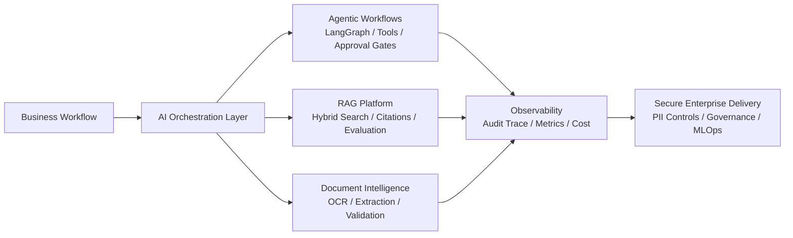

# Prasun Kumar

**AI/ML Engineer | Technical Lead | GenAI & Agentic AI Solution Architect | LangGraph | RAG | Azure OpenAI | Python**

I design and deliver production-minded AI systems across Agentic AI, LLM
applications, Retrieval-Augmented Generation, document intelligence, automation,
and MLOps. My focus is building enterprise AI platforms that are observable,
governed, secure, cost-aware, and practical enough to run inside real business
workflows.

I bring **9+ years of full-time software engineering experience** with hands-on AI/ML
delivery, technical leadership, system design, cloud-native architecture, and
cross-functional execution.

## Architecture Focus

## Technical Expertise Matrix

| Area | Hands-on Focus |
| --- | --- |
| Agentic AI | LangGraph-style orchestration, planner/retriever/validator/executor patterns, tool routing, approval gates |
| LLM Applications | Azure OpenAI, open-source LLM patterns, prompt governance, structured extraction, hallucination reduction |
| RAG Systems | Chunking, embeddings, hybrid retrieval, reranking, citations, privacy controls, recall/precision evaluation, feedback loops |
| LLMOps / MLOps | Evaluation harnesses, quality gates, model lifecycle cleanup, monitoring, reproducibility |
| LLM Platform Engineering | FastAPI gateways, provider routing, prompt registry, usage budgets, Kubernetes manifests, autoscaling, health checks, metrics |
| AI Security | Guardrails, jailbreak detection, prompt-injection controls, privacy-preserving RAG, SOC alert triage, malware triage, policy decisions, audit-friendly routing |
| Document AI | OCR pipelines, PII/PHI masking, schema validation, confidence scoring, human review |
| Cloud Architecture | Azure Functions, Service Bus, Blob Storage, Graph API, event-driven workflows, AWS exposure |
| Enterprise Governance | Audit trails, role-aware access, review queues, data minimization, AI security controls |
| Engineering Leadership | Technical design, delivery planning, code review, stakeholder alignment, production readiness |

## What I Build

- Agentic AI systems with planner, retriever, validator, executor, memory, and approval workflows.
- Enterprise RAG platforms with ingestion, chunking, hybrid search, citations, feedback loops, and quality evaluation.
- OCR + LLM document intelligence pipelines for extraction, redaction, validation, and human review.
- Event-driven AI automation using queues, retries, idempotency, dead-letter handling, and audit trails.
- LLMOps and AI governance patterns covering prompt/version control, evaluation gates, cost controls, and observability.
- Production LLM platform patterns with FastAPI gateways, model-provider abstraction, policy checks, Kubernetes deployment, autoscaling, and metrics.
- Privacy-preserving RAG controls for PII detection, redaction, sensitive chunk filtering, output leakage checks, and audit trails.
- AI guardrail services for jailbreak detection, prompt-injection screening, policy routing, and safe model handoff.
- Defensive cybersecurity AI labs for SOC alert enrichment, static malware triage, explainable risk scoring, and analyst escalation workflows.

## Flagship AI Repositories

| Repository | Architecture Signal |
| --- | --- |
| [enterprise-ai-ml-case-studies](https://github.com/Prasun0512/enterprise-ai-ml-case-studies) | Sanitized case studies with runnable POCs across GenAI, RAG, CV, and automation |
| [agentic-ai-langgraph-workflows](https://github.com/Prasun0512/agentic-ai-langgraph-workflows) | Multi-step agent workflow with state, tools, risk gates, and audit traces |
| [document-intelligence-llm-pipeline](https://github.com/Prasun0512/document-intelligence-llm-pipeline) | OCR + LLM extraction pipeline with validation and review routing |
| [email-to-case-genai-automation](https://github.com/Prasun0512/email-to-case-genai-automation) | Event-driven GenAI automation for email, attachment, extraction, and case creation |
| [enterprise-rag-quality-lab](https://github.com/Prasun0512/enterprise-rag-quality-lab) | RAG evaluation, retrieval metrics, PII masking, and grounded answer quality |
| [ai-resume-job-matcher](https://github.com/Prasun0512/ai-resume-job-matcher) | Explainable resume/JD matching assistant with skill gap analysis and suitability scoring |
| [production-llm-platform-on-kubernetes](https://github.com/Prasun0512/production-llm-platform-on-kubernetes) | FastAPI LLM gateway with provider routing, policy checks, usage budgets, metrics, Docker, and Kubernetes deployment assets |
| [privacy-preserving-rag-dlp](https://github.com/Prasun0512/privacy-preserving-rag-dlp) | RAG privacy layer with PII detection, redaction, sensitive chunk filtering, output leakage checks, and audit trails |
| [ai-soc-alert-copilot](https://github.com/Prasun0512/ai-soc-alert-copilot) | Defensive SOC alert copilot with SIEM normalization, MITRE mapping, playbooks, and analyst summaries |
| [ai-malware-triage-lab](https://github.com/Prasun0512/ai-malware-triage-lab) | Defensive malware triage with static feature extraction, explainable ML scoring, and SOC-style routing |
| [ai-jailguard](https://github.com/Prasun0512/ai-jailguard) | LLM security guardrail service for jailbreak, prompt-injection, policy-bypass, and secret-extraction checks |

## ML Foundation Projects

Earlier ML/CV repositories such as emotion detection, medical imaging
experiments, gesture recognition, fraud detection, credit-risk analysis, and
regression modeling are intentionally not pinned. I treat them as foundational
learning artifacts, while this profile now emphasizes enterprise GenAI,
Agentic AI, RAG, LLMOps, and production-ready AI architecture.

## What I Can Discuss In Interviews

- Architecture tradeoffs for queues, retries, DLQs, idempotency, and human review.
- RAG evaluation: chunking, retrieval baselines, citation coverage, confidence thresholds, and hallucination control.
- LLM cost control through model routing, deterministic baselines, caching, and evaluation gates.
- OCR + LLM extraction design with schema validation, confidence scoring, and PII masking.
- MLOps/LLMOps practices: versioned prompts, evaluation datasets, regression checks, monitoring, and audit trails.
- Azure event-driven design using Azure Functions, Service Bus, Blob Storage, Document Intelligence, Azure OpenAI, and Graph API.

## Enterprise AI Capabilities

- **Agentic systems:** planner/research/retrieval/validator/executor workflows, human approval, retry policies, stateful routing
- **RAG platforms:** document ingestion, OCR, metadata-aware chunking, vector search abstraction, evaluation metrics, citation generation
- **Automation platforms:** email-to-case, document-to-case, queue-based orchestration, idempotent processing, dead-letter handling
- **Governed AI:** PII/PHI redaction, auditability, prompt/version control, confidence thresholds, review queues
- **Production engineering:** Docker, CI/CD, tests, typed Python, config hygiene, observability hooks, cost controls

## Supporting AI Architecture Repositories

- [mlflow-mlops-ai-platform](https://github.com/Prasun0512/mlflow-mlops-ai-platform) - MLflow-style experiment tracking, evaluation gates, registry decisions, and monitoring handoffs
- [enterprise-ai-architecture-showcase](https://github.com/Prasun0512/enterprise-ai-architecture-showcase) - ADRs, HLD/LLD diagrams, AI security, and platform patterns
- [enterprise-llm-evaluation-framework](https://github.com/Prasun0512/enterprise-llm-evaluation-framework) - LLM/RAG evaluation and release-gate patterns
- [ai-reliability-engineering](https://github.com/Prasun0512/ai-reliability-engineering) - retry, fallback, poison queue, runbook, and postmortem patterns
- [production-llm-platform-on-kubernetes](https://github.com/Prasun0512/production-llm-platform-on-kubernetes) - production-minded LLM gateway on Kubernetes with FastAPI, policy checks, metrics, scaling, and deployment manifests
- [privacy-preserving-rag-dlp](https://github.com/Prasun0512/privacy-preserving-rag-dlp) - RAG privacy and DLP controls for prompts, retrieved chunks, outputs, and audit trails
- [ai-soc-alert-copilot](https://github.com/Prasun0512/ai-soc-alert-copilot) - defensive SOC alert enrichment with MITRE-style mapping, playbooks, scoring, and analyst summaries
- [ai-malware-triage-lab](https://github.com/Prasun0512/ai-malware-triage-lab) - defensive static malware triage with explainable risk scoring and analyst routing
- [ai-jailguard](https://github.com/Prasun0512/ai-jailguard) - LLM jailbreak and prompt-injection guardrails with API, CLI, tests, and Docker support

Some supporting repositories are intentionally documentation-first playbooks.
They are maintained as architecture artifacts for design reviews, operating
models, governance, and technical-lead practices rather than toy applications.

## Certification

**Post Graduate Program in Machine Learning & Artificial Intelligence**  
[Credential.net verification](https://www.credential.net/20453200-981b-4985-9ddf-2a44c5ee66cf)

## Awards and Recognition

- 3x Quarterly Team Award Winner
- 2x Superstar Award Winner
- 4x Technical Star Recognition
- Recognitions for We-NOT-Me, going the extra mile, thank-you impact, FunStar, PEP Silver, and 2017 hackathon participation

## Thought Leadership

Topics I actively follow and discuss: Agentic AI, production AI agents, GenAI
architecture, RAG systems, LLM reliability, AI governance, and emerging AI
engineering practices.

## Current Portfolio Direction

I am actively maintaining this profile around practical enterprise AI patterns:

- Agentic AI with LangGraph and tool-aware orchestration
- LLM evaluation and RAG quality measurement
- Azure AI platform integration patterns
- Document intelligence and workflow automation
- AI governance, security, and production readiness
- Defensive cybersecurity AI and secure GenAI guardrail patterns
- Technical leadership practices for AI delivery teams
- LLM evaluation and release-gate standards
- Enterprise integration, SaaS tenancy, platform engineering, reliability, and production AI operations

## Connect

- Portfolio: <https://prasun0512.github.io/Resume/>
- LinkedIn: <https://www.linkedin.com/in/prasun-kumar-1708/>
- YouTube: <https://www.youtube.com/@AIWizardry277>
